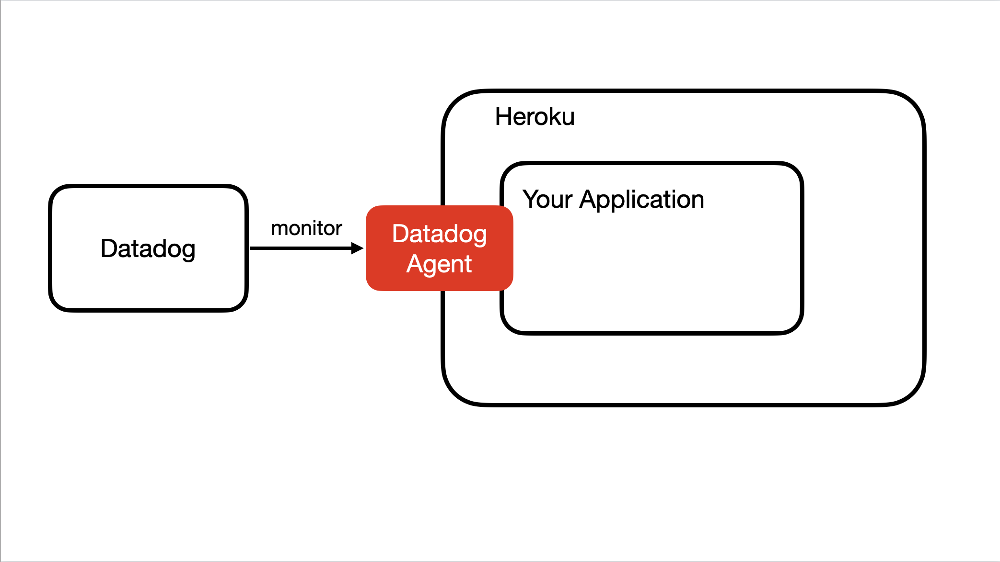

## What is Heroku?

Heroku is a platform as a service (PaaS) that helps developers to build, run, and operate applications entirely in the cloud. The platform is great to develop application as it manages hardware and servers, thereby letting developers focus on developing the application.

## What is Datadog?

Datadog is a monitoring and security platform for cloud applications. It provides, end-to-end traces, metrics, and logs to make applications, infrastructures, and third-party services entirely observable. It can monitor services such as servers, databases and tools and thus, aids in securing the system and avoiding downtime.

## Motivation
In DevOps, infrastructure of an application is often complicated. As a result, monitoring tools are important for people to quickly detect problems in resources and alert the right respondents to resolve the critical issues.

Among monitoring tools, Datadog is one of the most popular one. Therefore, we plan to create a tutorual to show how to use Datadog to monitor applications. Besides, since Heroku is a very popular cloud application platform, we decide to configure Datadog on it. 

## Learning Objective

To be able to determine the performance metrics and monitor events for infrastructure and cloud services. We will be first creating an application on Heroku and then using Datadog to analyse our application. The intended objective of this tutorial is to provide a deep understanding of how the Datadog application can be used to analyse and monitor the application and find any weakness. 

## Flow of Tutorial

1. Install dependencies
2. Create a Heroku account
3. Create your own website on Heroku
4. Create an account on Datadog
5. Configure Datadog and understand how it is used to monitor and analyse applications on Heroku

## Architecture

