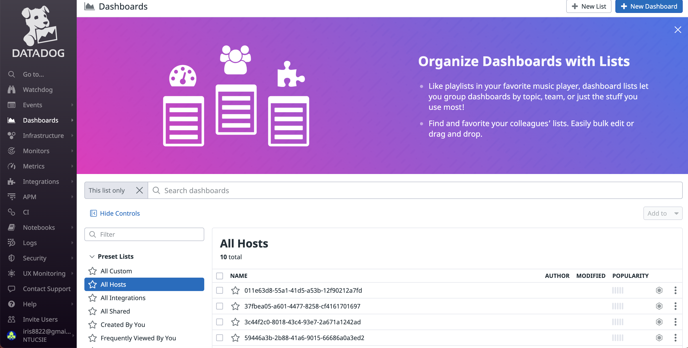
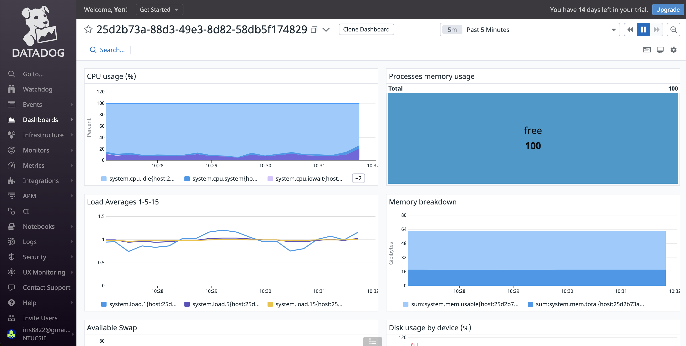
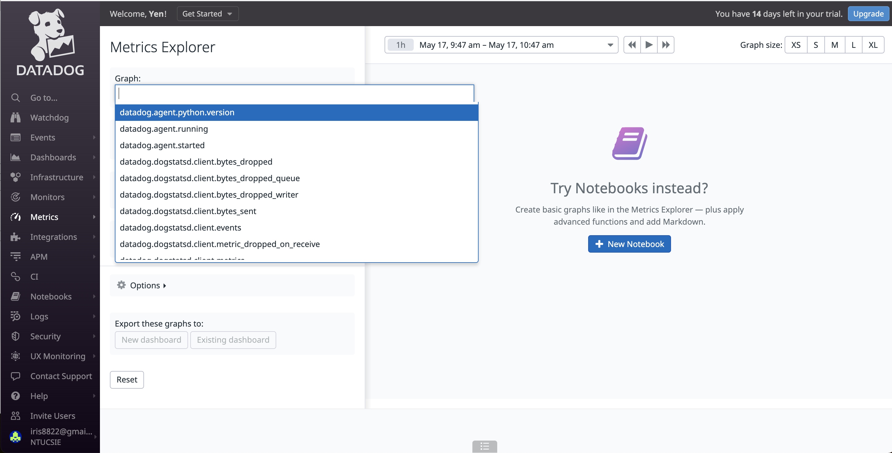

Go to `Dashboards/All Hosts`, and you can see the hosts you are currently monintoring.

Click on the host you want to look into, you can see overview of the data collected.

Metrics collected include CPU usage, Processes memory usage, etc. If you encounter a metric that you want to look into, you can look up in the `Metrics` tag.

